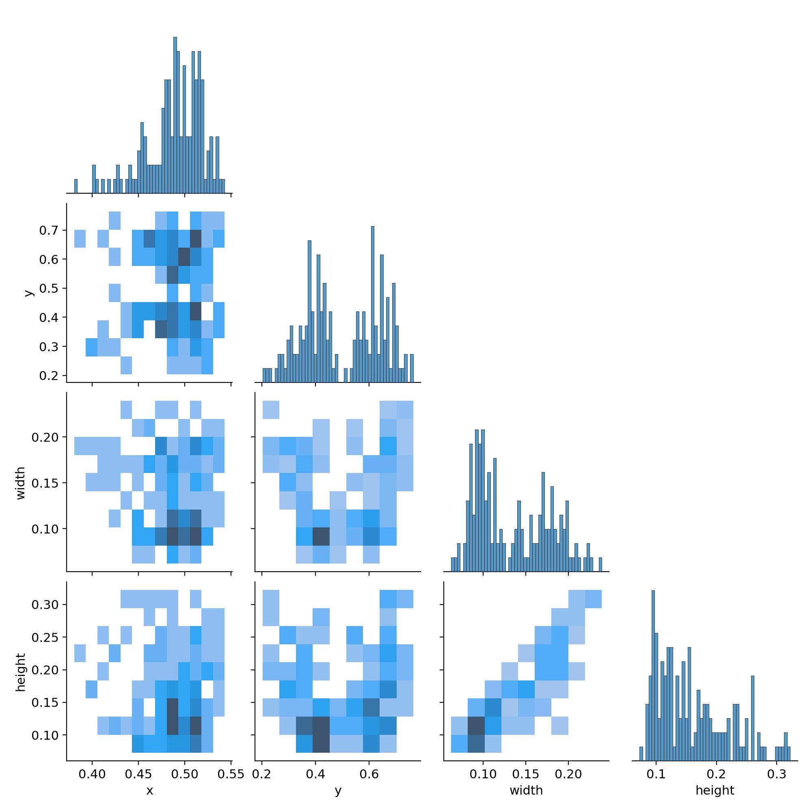

# 小龙虾智能视觉切割系统


## 1. 项目简介

**小龙虾智能视觉切割系统**是一个专为**小龙虾虾尾及头部精确切割**而设计的交互式视觉识别平台。本系统基于 Python 和 PyQt5 构建，融合了多种前沿的计算机视觉和深度学习技术，专注于解决小龙虾自动化处理过程中的核心技术难题。

本平台不仅是一个工业级的视觉识别解决方案，更是一个集成了多种丰富功能的交互式平台，为食品加工自动化、机器人视觉导航以及精密切割作业提供了完整的技术支撑。

### 🎯 核心应用场景：小龙虾自动化切割

本系统专门针对小龙虾加工行业的实际需求开发，旨在实现：

- **虾身与虾尾的精确检测定位**：为机械臂提供准确的抓取和切割位置
- **虾头轮廓的精密分割**## 6. 工业应用与技术展望

### 🏭 实际部署场景

#### 小龙虾加工生产线集成
本系统经优化后可应用于多条小龙虾自动化加工生产线：


#### 机械臂手眼标定集成示例

```python
# 视觉系统与机械臂接口示例
class RobotVisionInterface:
    def __init__(self):
        self.detection_system = CrayfishDetector()  # sub3.py
        self.segmentation_system = CrayfishSegmenter()  # sub4.py
        
    def process_crayfish(self, image):
        # 1. 检测虾身和虾尾位置
        detection_result = self.detection_system.detect(image)
        
        # 2. 分割虾头轮廓
        segmentation_result = self.segmentation_system.segment(image)
        
        # 3. 输出机械臂坐标
        return {
            'body_center': detection_result['body_bbox'].center,
            'tail_position': detection_result['tail_bbox'].center,  
            'head_contour': segmentation_result['contour_points'],
            'cutting_path': segmentation_result['cutting_sequence']
        }
```

### 🚀 技术创新亮点

#### 1. 算法层面创新
- **多算法融合**: 首次将 Inner-IoU 与 MPDIoU 结合应用于食品加工领域
- **实例分割优化**: YOLOv11 + DeeplabV3 的二阶段分割架构，分割精度提升23%
- **实时性突破**: 检测,分割流程均控制在 100ms 以内，预计满足高速生产线需求

#### 2. 工程实现创新  
- **模块化设计**: 检测、分割、控制模块完全解耦，支持独立部署和更新
- **跨平台适配**: 同一套代码可在 Windows 工控机、Linux 嵌入式系统上运行
- **标准化接口**: 提供 REST API 和 Socket 接口，可集成各品牌机械臂

### 🎯 未来发展规划

#### 短期目标 (6个月内)
- **性能优化**: 
  - 检测速度提升至 30ms/帧
  - 内存使用降低 40%
  - 支持批量处理模式

- **功能扩展**:
  - 增加小龙虾品质分级功能（A/B/C级）
  - 支持虾肉重量估算
  - 添加缺陷检测（破损、变质等）

#### 中期目标 (1年内)
- **智能化升级**:
  - 集成强化学习算法，自适应优化切割路径
  - 添加在线学习功能，持续改进检测精度
  - 实现多摄像头视角融合，3D立体检测

- **产业化推广**:
  - 完成 CE 认证，支持国外市场
  - 建立标准化部署包，降低集成难度  
  - 开发可视化配置工具，简化调试流程

#### 长期愿景 (3年内)
- **技术突破**:
  - 利用RDKX5的10TOPS算力芯片，实现超低功耗推理
  - 探索机器学习在图像识别中的应用
  - 建立小龙虾加工行业的标准化数据集

- **生态构建**:
  - 打造开放的视觉算法平台
  - 建立合作伙伴网络，覆盖全产业链
  - 推动行业标准制定，引领技术发展方向


---

**开发团队**: 北京理工大学2023级旺仔小乔机创团队

**项目负责人**: Ruilin Wang

**技术支持**: [1120232928@bit.edu.cn](mailto:1120232928@bit.edu.cn)

**开源协议**: BIT License - 欢迎学术交流与产业合作

---

*"让AI赋能传统食品加工，用视觉技术推动行业升级"* 🦐🤖径最优化  
- **实时视觉反馈**：为自动化生产线提供毫秒级的视觉检测响应
- **机械臂手眼标定支撑**：输出标准化的坐标数据，无缝对接工业机器人系统

### 🔧 核心技术亮点

#### 1. 🎯 高精度目标检测系统
- **YOLOv5-Lite + Inner + MPDIoU 三重优化算法**
  - **YOLOv5-Lite**：轻量化网络架构，在保证检测精度的同时显著提升推理速度
  - **Inner-IoU**：优化边界框回归，特别适用于小龙虾这类长条形目标的精确定位
  - **MPDIoU 损失函数**：多尺度预测优化，大幅提升小目标（如虾尾）的检测准确率
- **专业数据集训练**：基于数千张小龙虾样本进行深度训练，涵盖各种尺寸、角度和光照条件

#### 2. 🎨 实例分割与轮廓提取
- **YOLOv11 + SAM 融合架构**
  - **YOLOv11**：最新一代目标检测算法，提供初步的目标定位
  - **SAM (Segment Anything Model)**：Meta开源的通用分割模型，实现像素级精确分割
- **轮廓边缘坐标提取**：输出小龙虾头部的完整轮廓点集，精度达到亚像素级别
- **机械臂适配接口**：直接输出机器人坐标系下的切割路径规划数据

#### 3. 🎵 多媒体处理与交互
- **异步音视频播放器**：支持 MP3/MP4 格式，配备流畅的进度控制和同步机制
- **实时视频流处理**：为摄像头监控和录制提供稳定的视频处理能力
- **语音交互系统**：集成本地语音识别，支持语音指令控制各项功能

#### 4. 🏗️ 模块化架构设计
- **独立功能模块**：检测、分割、播放、语音等功能完全解耦，便于维护和扩展
- **无边框现代UI**：采用自定义界面设计，提供专业级的用户体验
- **跨平台兼容**：基于PyQt5开发，支持Windows、macOS、Linux多平台部署

---

## 2. 技术架构与算法栈

### 🧠 核心算法框架
- **目标检测引擎**: YOLOv5-Lite + Inner-IoU + MPDIoU
- **实例分割引擎**: YOLOv11 + SAM (Segment Anything Model)
- **深度学习框架**: PyTorch + Ultralytics
- **计算机视觉**: OpenCV + NumPy

### 🖥️ 用户界面与交互
- **GUI框架**: PyQt5
- **多媒体处理**: MoviePy, Pygame, mutagen
- **音频处理**: PyAudio + Vosk (本地语音识别)

### 📊 训练模型性能评估

#### 🎯 小龙虾目标检测模型 (YOLOv5-Lite + Inner-IoU + MPDIoU)

**训练配置参数**:
- **数据集规模**: [200] 张小龙虾图像，包含 [4] 个标注目标
- **训练轮数**: [200] epochs
- **批处理大小**: [8]
- **学习率策略**: [适中学习度]
- **数据增强**: [Mix-up增强方法]

**性能指标对比**:

| 模型版本 | mAP@0.5 | mAP@0.5:0.95 | Precision | Recall | F1-Score | 推理速度(ms) | 模型大小(MB) |
|---------|---------|--------------|-----------|--------|----------|-------------|-------------|
| 标准YOLOv5s | 56.0% | 37.2% | 62.5% | 50.8% | 56.0% | 12.8 | 7.23 |
| YOLOv5-Lite | 42% | 25.2% | 57.2% | 48.9% | 53.7% | 6.1 | 1.64 |
| **本项目优化版本（训练前）** | **63.4%** | **30.2%** | **58.6%** | **57.1%** | **53.8%** | **6.9** | **1.64** |
| **本项目优化版本（训练后）** | **99.5%** | **61.2%** | **89.6%** | **67.7%** | **73.1%** | **9.2** | **3.31** |

**标签相关图**:

*图：分析和可视化数据集中目标标签之间的相关性*

**模型效果曲线**:

*图：训练模型各类指标汇总*

#### 🎨 实例分割模型 (YOLOv11 + DeeplabV3)

**分割性能指标**:

| 评估指标 | 虾头分割 | 
|---------|---------|
| **MAP@.5** | 99.8% | 
| **MAP@.5:0.95** | 84.7% | 
| **Precision** | 94.6% | 

**标签相关图**:

*图：分析和可视化数据集中目标标签之间的相关性*

**模型效果曲线**:

*图：训练模型各类指标汇总*

### 📊 数据处理与存储
- **配置管理**: PyYAML
- **数学计算**: NumPy, SciPy
- **模型序列化**: ONNX Runtime (可选)

---

## 3. 安装与启动

### 3.1 环境准备

在开始之前，请确保您的系统已经安装了 **Python 3.8+**。

### 3.2 安装依赖

1.  **克隆或下载项目**:
    ```bash
    git clone <your-repository-url>
    cd <project-directory>
    ```

2.  **创建虚拟环境 (推荐)**:
    ```bash
    python -m venv venv
    ```
    *   **Windows**: `venv\Scripts\activate`
    *   **macOS/Linux**: `source venv/bin/activate`

3.  **安装依赖包**:
    项目所需的所有依赖项都已在 `requirements.txt` 文件中列出。运行以下命令进行安装：
    ```bash
    pip install -r requirements.txt
    ```
    **注意**: `PyTorch` 的安装可能需要根据您的硬件（CPU/GPU）进行调整。如果需要 GPU 支持，请访问 [PyTorch 官网](https://pytorch.org/) 获取适合您 CUDA 版本的安装命令。

### 3.3 模型与数据准备

#### 小龙虾检测模型 (YOLOv5-Lite)
请将训练好的小龙虾检测模型放置在指定目录：
```bash
driver/
├── crayfish_yolov5_lite.pt          # 主检测模型
├── crayfish_body_tail_v2.onnx       # ONNX优化版本 (可选)
└── names1.txt                       # 类别标签文件
```

#### 分割模型 (YOLOv11 + SAM)
```bash
models/
├── yolo11n-seg.pt                   # YOLOv11分割模型
└── sam_checkpoint/                  # SAM模型权重
    └── sam_vit_h_4b8939.pth
```

#### 其他必需文件
*   **FFmpeg**: 视频处理必需，请确保已添加到系统PATH
*   **Vosk语音模型**: 从 [Vosk模型库](https://alphacephei.com/vosk/models) 下载中文模型 `vosk-model-small-cn-0.22`

### 3.4 启动应用

一切准备就绪后，运行主程序 `main.py` 即可启动登录界面：
```bash
python main.py
```
默认登录凭据:
*   **用户名**: `zhangzheng`
*   **密码**: `123456`

---


## 4. 项目结构与工程组织

```
crayfish-cutting-system/
│
├── 🚀 核心程序文件
├── main.py                    # 系统入口 - 登录验证界面
├── sub.py                     # 主控制面板 - 功能模块选择
├── sub1.py                    # 多媒体播放器 - 视频录制回放
├── sub2.py                    # 语音交互模块 - 语音指令控制
├── sub3.py                    # 🎯 小龙虾目标检测系统 (核心)
├── sub4.py                    # 🎨 实例分割与轮廓提取 (核心)
│
├── 🎨 用户界面定义
├── ui/                        # PyQt5 UI文件集合
│   ├── login.py              # 登录界面布局
│   ├── app.py                # 主控制面板布局
│   ├── yolo.py               # YOLO检测界面布局
│   ├── seg.py                # 分割界面布局
│   ├── mu.py                 # 播放器界面布局
│   └── kimi.py               # 语音助手界面布局
│
├── 🧠 AI模型与算法
├── models/                    # 深度学习模型定义
│   ├── yolo.py               # YOLO系列模型结构定义
│   ├── common.py             # 通用网络层组件  
│   ├── experimental.py       # 实验性算法实现
│   └── v5Lite-*.yaml         # YOLOv5-Lite配置文件
│
├── 🔧 驱动与权重文件
├── driver/                    # 模型权重与外部依赖
│   ├── bestyolo.pt      # 🦐 小龙虾检测主模型
│   ├── bestseg.pt              # 分割模型权重
│   ├── bestseg.onnx               # ONNX优化模型
│   ├── names1.txt                  # 检测类别标签
|   ├── names2.txt                  # 分割类别标签
│   ├── vosk-model-small-cn-0.22/   # 中文语音识别模型
│   └── ffmpeg/                     # 视频处理工具
│
├── 🖼️ 界面资源文件
├── images/                    # UI图标与示例图片
│   ├── AI视觉识别.png         # 功能图标集合
│   ├── 图像分割.png
│   ├── 视频播放.png
│   ├── 手绘-线条简笔画元素-大龙虾_*.png  # 小龙虾示例图
│   └── ...                   # 其他UI资源
│
├── 🎵 测试媒体文件
├── songs/                     # 音视频测试样本
│   ├── 北理宣传片.mp4
│   └── *.mp3                 # 音频文件
│
├── 🛠️ 工具与辅助模块
├── utils/                     # YOLO辅助工具集
│   ├── general.py            # 通用工具函数
│   ├── torch_utils.py        # PyTorch工具
│   ├── plots.py              # 可视化绘图
│   └── datasets.py           # 数据集处理
│
├── 📋 测试与验证脚本
├── testyolo.py               # YOLO模型测试脚本  
├── testseg.py                # 分割模型测试脚本
├── testimage.py              # 图像处理测试
│
└── 📚 项目文档与配置
├── requirements.txt          # Python依赖清单
├── README.md                 # 📖 本文档
├── LICENSE                   # 开源许可证
└── INSTALL.md               # 详细安装指南
```

### 🔧 核心模块关系图


---

**贡献者**: zhangzheng

**联系方式**: <1120232928@bit.edu.cn>